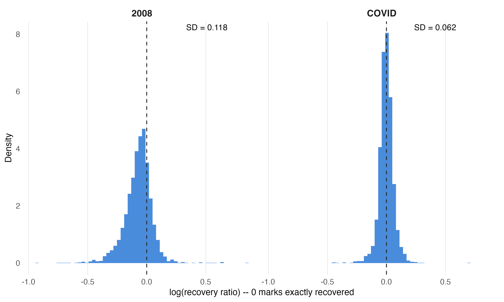
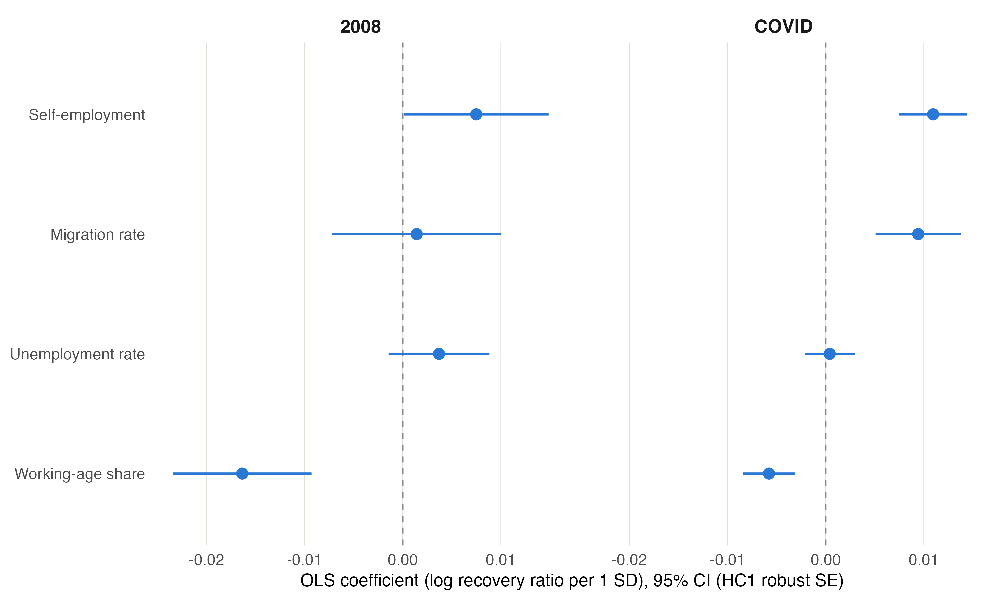
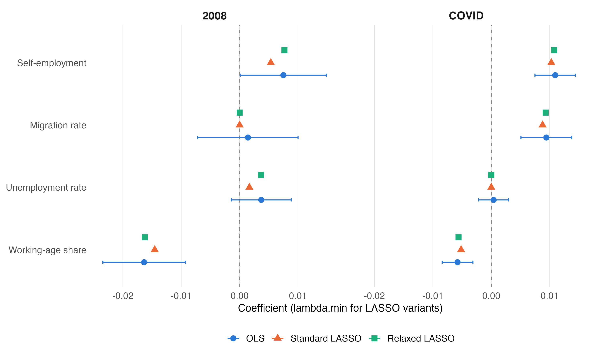
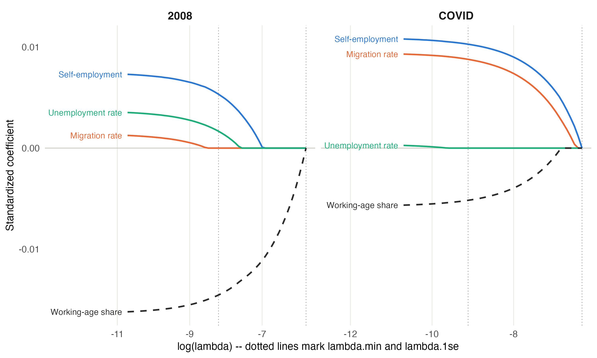
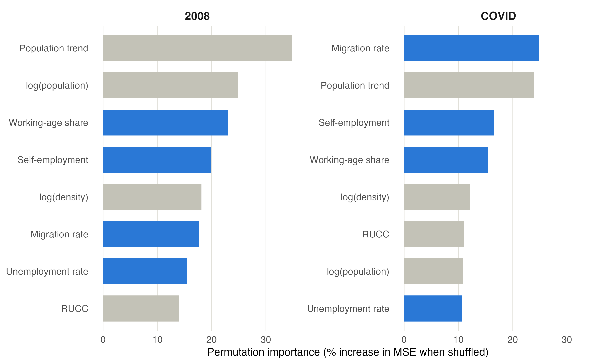
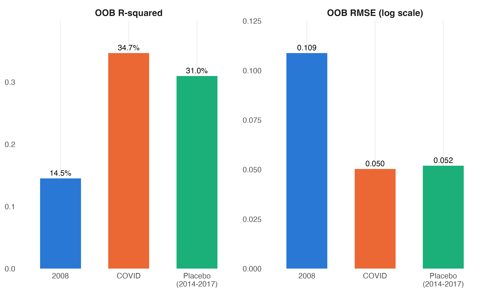
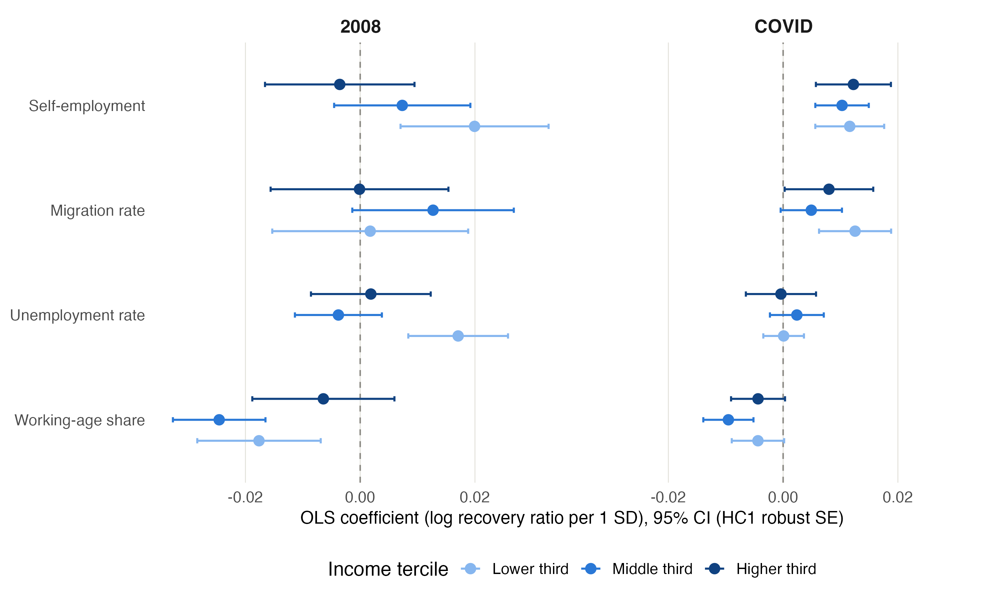
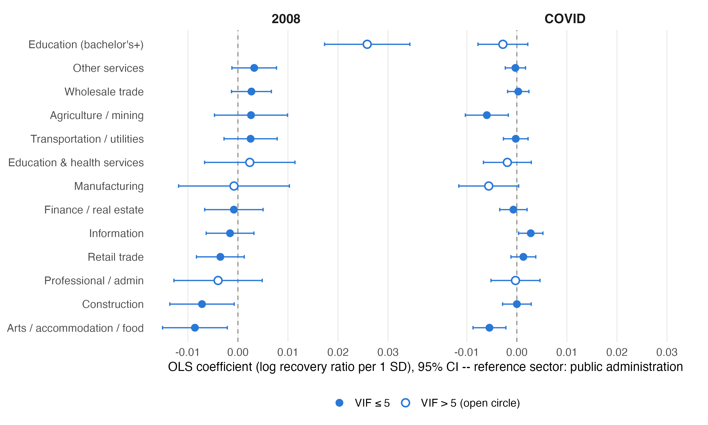
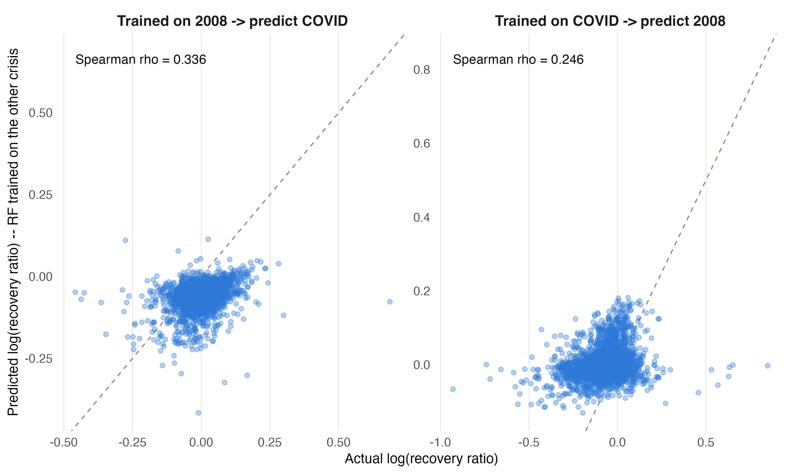

\newpage

# Abstract

When a recession hits, some counties climb back to where they were within a few
years. Others never do. We wanted to know whether that difference is predictable
— and specifically, whether the traits that helped a county recover from the 2008
financial crisis also helped it recover from the COVID-19 downturn.

We built a dataset covering about 3,000 U.S. counties and measured recovery as
employment two to three years after each crisis, compared to the peak before it.
We then tested four pre-crisis traits: self-employment, migration, unemployment,
and the share of the population that is working age. We controlled for wealth
throughout, because we did not want to rediscover the obvious fact that richer
places recover more easily.

Two traits predicted recovery in both crises. One predicted recovery only from
COVID. One predicted nothing. When we added industry data for a smaller set of
counties, we found that construction-heavy counties struggled in 2008 and were
completely unaffected in COVID, while information-sector counties showed the
opposite pattern.

Our most surprising result came from a test we ran to check our own work. We
tried to predict employment change over a calm, non-crisis period and found it
was about as predictable as COVID recovery. That means COVID was ordinary. The
2008 financial crisis, by contrast, was only half as predictable as a normal
year — the real anomaly in our data.

\newpage

# Introduction

Every recession leaves some places behind. Drive through parts of Ohio or Michigan
and you can still see the 2008 financial crisis in boarded-up storefronts. Drive
through parts of Nevada or Florida and you will see the same thing from 2020.
But the two sets of places are not the same places, and that is the puzzle that
started this project.

The 2008 crisis began in housing and credit markets. The 2020 downturn began with
a virus and the shutdowns that followed. They had almost nothing in common except
that both wrecked local economies. If the same kinds of counties bounced back from
both, that would suggest economic resilience is a durable property of a place —
something baked into how a local economy is built. If different counties bounced
back from each, resilience is not a property of the place at all. It depends on
how the shock arrives.

That distinction matters beyond academic curiosity. Federal recovery aid is
allocated using formulas built on county characteristics. If the traits that
predict vulnerability change from crisis to crisis, a single formula cannot work
for both.

## The wealth problem

There is one obvious answer to "which counties recover best," and it is boring:
the rich ones. Wealthier counties have more savings, more diversified employers,
better credit access, and more capacity to absorb a shock. This is well documented
and nobody needs another study to confirm it.

So we designed the project specifically to look past wealth. Our question is not
"do rich counties recover better." It is: **among counties that were similarly
well-off before a crisis, what separated the ones that bounced back from the ones
that stayed stuck?**

# Research Question

> Among counties with similar pre-crisis wealth, which measurable traits best
> predict how fully a county recovers from an economic crisis — and are those
> traits the same for the 2008 financial crisis and the COVID-19 downturn?

This is an **associational** study. We can identify which traits move together
with recovery. We cannot prove that any trait *causes* recovery, because we are
observing counties as they exist rather than running an experiment.

# Data

## Sources

We pulled from six federal sources and combined them into a single file.

| Source | What we used it for |
|---|---|
| BLS Local Area Unemployment Statistics (LAUS) | County employment, used to build the recovery measure; pre-crisis unemployment rate |
| Census SAIPE | Median household income and poverty rate |
| Census Population Estimates Program (PEP) | Total population, working-age share, population trend |
| Census land area | Denominator for population density |
| IRS Statistics of Income | County-to-county migration flows |
| Bureau of Economic Analysis (BEA) | Proprietor share, our self-employment measure |
| USDA Economic Research Service | Rural-Urban Continuum Code |

: Primary data sources {tbl-colwidths="[35,65]"}

An unusual one worth explaining: the IRS migration data. When people move, they
file taxes from a new address, which lets the IRS count roughly how many people
entered and left each county. It is an odd source for an economics project, but
it is the best county-level migration data that exists.

## Measuring recovery

Our outcome variable is a ratio:

$$\text{recovery ratio} = \frac{\text{employment 2--3 years after the trough}}{\text{peak employment before the crisis}}$$

A value of 1.0 means a county got back exactly to where it started. Above 1.0
means it recovered and grew. Below 1.0 means it was still down.

We found each county's own peak and trough inside a search window rather than
using fixed national dates, because crises did not hit every county on the same
schedule. For the 2008 crisis, the peak is a county's highest employment year in
2006–2008, and the trough is its lowest employment year from the year after its
peak through 2013. For COVID, the peak window is 2018–2019 and the trough window
runs through 2022.

The numerator is then the average of employment in that county's trough year plus
two and trough year plus three. Every county gets its own peak year, trough year,
and measurement years, but the plus-two/plus-three offset rule is identical across
both crises — which is what keeps the comparison fair.

We kept every county, including those that never recovered. They show up as low
values, and there are a lot of them — a real feature of the data, not a problem
to clean away.

**A note on the transform.** We take the natural log of the recovery ratio in
every model. The raw ratio is bounded below by zero and unbounded above, which
makes it lopsided. Logging fixes that and makes the two crises more comparable
to each other: raw skewness was 1.31 for 2008 and 3.46 for COVID, and after
logging, −0.36 and 0.91.

## Predictors

Four traits, all measured **strictly before** each crisis (2007 for the 2008
crisis, 2019 for COVID):

- **Self-employment** — proprietor share of income (BEA). We had no strong prior
  here. Self-employment could speed recovery, because small operators adapt
  quickly, or slow it, because they have thinner buffers.
- **Migration** — net migration rate (IRS). A proxy for economic momentum.
- **Pre-crisis unemployment** — baseline unemployment rate (BLS). Our hypothesis
  was that already-struggling labor markets would recover worse.
- **Working-age share** — percent of the population of working age (PEP).

## Controls

Income, poverty rate, log population, log density, Rural-Urban Continuum Code,
and pre-crisis population trend. These are in every model and we never interpret
them. They exist so the four studied predictors are measured fairly.

Two are worth explaining:

**Rural-Urban Continuum Code (RUCC)** is USDA's 1-to-9 score for how urban a
county is. We treat it as an unordered category rather than a number, because
the scale is not a straight line — codes 4 through 9 alternate based on whether
a county sits next to a metro area, so a one-step move does not mean the same
thing everywhere on the scale.

**Pre-crisis population trend** separates counties that were already shrinking
for structural reasons from counties that genuinely got knocked down by a crisis.
Without it we would confuse decades-long rural decline with crisis damage.

## No data leakage

Every predictor and control is measured before its crisis year — never during,
never after. This rule cost us: we could not use the 2005–2009 American Community
Survey for education, because that file contains 2008 and 2009 data. We audited
this and confirmed it holds throughout.

# How We Handle Wealth

This is the methodological core of the project, so it deserves its own section.

Wealth is the strongest predictor of recovery and the least interesting one. We
handle it in two ways.

**Primary approach: control for it continuously.** Income and poverty are in
every model. In a multiple regression, a coefficient answers a conditional
question. The coefficient on self-employment is not "the effect of
self-employment." It is "the effect of self-employment among counties at the same
income level." The model builds that estimate by comparing counties that have
similar incomes but different self-employment rates.

That is exactly our research question, implemented precisely.

**Secondary approach: wealth bands.** We split counties into three income groups
and re-run the models inside each. Controlling assumes a trait works the same way
everywhere on the income scale. Banding lets it work differently. That difference
is worth testing rather than assuming, and as we show later, it uncovered a real
effect that the pooled model hid.

One technical detail that matters: in our LASSO models we set
`penalty.factor = 0` on every control. LASSO normally shrinks weak variables
toward zero, and if it shrank income out, our "holding wealth constant" claim
would quietly stop being true in the model we were reporting.

# Methods

We use four methods. Running several and checking whether they agree is stronger
evidence than trusting any one of them.

**Multiple linear regression (OLS).** The baseline. Gives us a coefficient and a
p-value for each predictor. We use HC1 robust standard errors because our
diagnostics showed the migration variable's spread widening in small-population
counties — a rate computed on a small denominator swings wildly. Robust errors fix
the resulting inference problem without altering the data.

**LASSO.** A regression that penalizes complexity. It shrinks weak coefficients
toward zero and drops the weakest entirely, which makes it a variable-selection
tool. Cross-validated over 10 folds.

**Relaxed LASSO.** Standard LASSO does two jobs at once: picking variables and
shrinking them. The shrinking makes surviving coefficients look smaller than they
really are. Relaxed LASSO separates the jobs — it picks the same variables, then
refits without the shrinkage, so coefficients come back at full size.

**Random forest.** Builds hundreds of decision trees on random subsets of the data
and averages them. It captures curved and interacting relationships that a linear
model misses, and it reports which variables matter most for prediction. We run it
twice per crisis: once **with** income and poverty, to get the best possible
prediction accuracy, and once **without**, to get variable importance. Income
dominates the importance rankings if left in, which would drown out the four
traits we actually want to compare.

Every model uses the same seed, the same predictor set, and the same outcome
transform for both crises. That symmetry is what makes the cross-crisis comparison
meaningful.

\newpage

# Results

## What recovery actually looked like

The two crises produced very different distributions.

|  | 2008 | COVID |
|---|---|---|
| Counties in model | 3,073 | 3,017 |
| Mean log recovery | −0.072 | −0.002 |
| SD of log recovery | 0.118 | 0.062 |

: Outcome distributions on the log scale

The average county was about 7% below its pre-crisis peak at the 2008 checkpoint,
and essentially exactly at peak at the COVID checkpoint. More importantly, **2008
spread counties nearly twice as far apart.** Hold onto that — it matters for how
we read the prediction results later.

## The main result

| Predictor | 2008 | COVID |
|---|---|---|
| Working-age share | **−0.0164** (p<.001) | **−0.0058** (p<.001) |
| Self-employment | **+0.0075** (p=.047) | **+0.0109** (p<.001) |
| Migration rate | +0.0014 (p=.75) | **+0.0094** (p<.001) |
| Unemployment rate | +0.0037 (p=.16) | +0.0004 (p=.75) |

: Main OLS results. Bold indicates significance at the 0.05 level.

Four findings, one per row.

**Working-age share predicts recovery in both crises — negatively.** This was our
largest 2008 effect and it runs opposite to intuition. Counties with *more*
working-age people recovered worse. A plausible explanation is that
retirement-heavy counties have income streams — Social Security, pensions — that
do not depend on local employment. That money keeps flowing into local businesses
during a downturn and props up demand. We cannot test that mechanism with our
data, so we offer it as a hypothesis rather than a conclusion.

**Self-employment predicts recovery in both crises — positively.** The adaptability
story wins over the fragility story. The effect is larger and more precisely
estimated in COVID.

**Migration is the sharpest contrast in the project.** Statistically invisible in
2008 (p=.75), and one of the strongest predictors in COVID (p<.0001). Not a sign
flip — a relevance flip. The same measurement, on the same counties, using the same
model, goes from meaning nothing to meaning a great deal depending on which crisis
hit.

**Pre-crisis unemployment predicts nothing.** Our hypothesis was that struggling
labor markets would recover worse. Across two crises, four methods, and 3,000
counties, we found no support for it in the pooled models. This is a clean null
result and we report it as one. (Section 7.6 complicates it in an interesting way.)

## Do the methods agree?

They do, and this is one of the more reassuring results in the project.

| Predictor | Crisis | Standard LASSO | Relaxed LASSO | OLS |
|---|---|---|---|---|
| Self-employment | 2008 | 0.00533 | 0.00767 | 0.00748 |
| Unemployment | 2008 | 0.00167 | 0.00366 | 0.00369 |
| Working-age share | 2008 | −0.01454 | −0.01623 | −0.01635 |
| Self-employment | COVID | 0.01028 | 0.01076 | 0.01094 |
| Migration | COVID | 0.00878 | 0.00930 | 0.00943 |
| Working-age share | COVID | −0.00517 | −0.00561 | −0.00578 |

: Three methods, same coefficients

Read across any row. Standard LASSO produces the smallest number, because it is
shrinking. Relaxed LASSO removes the shrinkage and lands almost exactly on the OLS
value. Two of the 2008 estimates match OLS to four decimal places.

This tells us our OLS coefficients are not an artifact of one method's assumptions.
Three approaches with different mathematics arrive at the same magnitudes.

Selection agrees too. For COVID, LASSO keeps exactly the three predictors that OLS
found significant. For 2008 there is one mismatch — LASSO keeps unemployment, which
OLS did not find significant — and Section 7.6 explains why.

**One honest note about LASSO.** At the more conservative penalty setting
(`lambda.1se`), all four studied predictors drop to zero in both crises. This is
not mysterious. Our controls are unpenalized, so the model already has income,
poverty, population, density, population trend, and eight RUCC categories doing
work before the studied predictors get a chance. Against that baseline, dropping
four small coefficients costs almost nothing in prediction error.

The correct reading is that these predictors add little **predictive** value beyond
the controls — which is entirely compatible with them being statistically
detectable and real. We report the less conservative setting as our primary LASSO
result and let OLS and random forest carry the argument.

## Which predictors matter most?

The random forest rankings tell the same story as the regression, which is worth
noting because it is a completely different kind of model.

Migration ranks **first for COVID and sixth for 2008** — the same relevance flip
the regression found. Unemployment ranks near the bottom in both crises. The
methods disagree about nothing important.

## How predictable is recovery? (And the test that changed our answer)

We originally planned to headline this comparison:

|  | OOB R² | OOB RMSE |
|---|---|---|
| 2008 | 14.5% | 0.109 |
| COVID | 34.7% | 0.050 |

COVID recovery looked more than twice as predictable as 2008 recovery. Our
interpretation was that COVID hit through local economic structure we could
measure, while 2008 arrived through financial channels invisible at the county
level.

**Then we tested that claim and it did not survive.**

We ran a placebo: same predictors, same controls, same methods, but predicting
employment change over 2014–2017, an ordinary non-crisis stretch. If COVID's
predictability were really about COVID, a calm period should look very different.

|  | OOB R² | OOB RMSE |
|---|---|---|
| 2008 | 14.5% | 0.109 |
| **Placebo (2014–17)** | **31.0%** | **0.052** |
| COVID | 34.7% | 0.050 |

The calm window came back at 31%, sitting almost on top of COVID's 34.7%. So
there is nothing special about COVID's predictability. County employment is just
generally about 31% predictable from these traits, and COVID recovery behaved like
a normal period.

**But the test did not destroy the finding — it relocated it.** Now we have a
baseline, and against that baseline:

> A global pandemic hit U.S. counties along completely ordinary lines. The 2008
> financial crisis was only **half** as predictable as a normal year.

2008 is the anomaly, not COVID. That is a more surprising claim than the one we
started with, and it survives its own robustness test. Most people asked to guess
would say the pandemic was the more chaotic, less predictable event. The data says
the opposite.

One more piece of supporting evidence. 2008 had *more* variation in outcomes
(SD 0.118 vs 0.062) and *less* explanation of it. More dispersion combined with
worse predictability is exactly the signature of a shock imposed from outside a
local economy rather than arising from its structure.

**Two limitations on the placebo.** The calm window is three years rather than
four to five, and it falls inside a growth period. Its population-trend control
also uses a three-year window instead of the seven-year window in our main models,
because the Census changed its population estimation methodology between those
periods and mixing the two would produce a meaningless number.

## Does wealth change the story?

This is where banding earned its place. The pooled models were hiding something.

**Unemployment: null overall, strongly significant among poor counties.** Pooled
2008 p=.16. In the lower-income band alone: coefficient +0.0171, **p=.0001**.

Note the direction. **Positive.** Higher pre-crisis unemployment associated with
*better* recovery in poor counties — the opposite of our hypothesis. The likely
explanation is mean reversion: a county sitting at 9% unemployment has slack in
its labor market and room to reabsorb workers. A county at 3% is already near full
employment and has nowhere to climb.

This also explains why LASSO kept unemployment for 2008 while OLS called it
insignificant. There is a real effect there; it just only exists in part of the
income distribution, so pooling averages it away.

**Self-employment changes sign across bands in 2008.**

| Income band | 2008 coefficient |
|---|---|
| Lower | +0.0199 |
| Middle | +0.0073 |
| Higher | −0.0036 |

Self-employment helped poorer counties recover from the financial crisis and
slightly hurt richer ones. Both of our competing hypotheses were right, in
different places.

**COVID shows no such pattern.** All four predictors hold the same sign across all
three bands. Whatever COVID did to county economies, it did it fairly uniformly
across the wealth distribution, while 2008's effects depended heavily on how
wealthy a county already was.

That is itself a cross-crisis difference, and it is one we would have missed
entirely if we had only run the pooled models.

\newpage

# Extension: Adding Education and Industry

Our main analysis uses four predictors because those are the only ones available
for all 3,000 counties before 2008. We tested a wider set on a smaller sample.

## Why the sample shrinks

Education and industry data for 2007 come from the American Community Survey, and
the ACS only publishes for counties above a population threshold. The best
pre-crisis file — the 2005–2007 three-year estimates — covers counties above
20,000 people. That drops us to **1,766 counties.**

Those are not a random 1,766. The threshold removes small rural counties
specifically. So this extension is not a smaller version of the main analysis; it
is an analysis of **larger counties only.** We report it as such.

## Reading the extension honestly

Comparing the main analysis directly to the extension would be misleading, because
two things change at once: the sample shrinks *and* new predictors enter. So we
built a middle model — the original four predictors, on the smaller sample — that
lets us change one thing at a time.

All coefficients here are standardized on the **main analysis** scale, not the
extension's own scale. This matters more than it sounds. A standardized coefficient
depends on how much the predictor varies in the sample, and self-employment varies
less once rural counties are removed — so part of any apparent shrinkage would be
a measurement artifact rather than a real change. Rescaling removes that artifact.

After rescaling, here is what actually changes:

**Caused by the smaller sample:** self-employment loses significance in 2008
(p=.047 → p=.595). This makes sense. Self-employment is concentrated in small
rural counties, and those are exactly the counties the threshold removed. The
effect is real; it just lives in the places this sample excludes.

**Caused by the added predictors:** working-age share loses 2008 significance
(p<.0001 → p=.106), and unemployment becomes significant in both crises with
opposite signs. That last one is instability, not discovery.

**Unaffected by either:** migration. Null in 2008, significant in COVID, throughout.

## The industry finding

This is what the extension was for.

| Sector | 2008 | COVID |
|---|---|---|
| Construction | **−0.0072** (p=.029) | 0.0000 (p=.995) |
| Information | −0.0015 (p=.547) | **+0.0028** (p=.025) |
| Agriculture / mining | +0.0027 (p=.460) | **−0.0060** (p=.006) |
| Arts / accommodation / food | **−0.0085** (p=.010) | **−0.0055** (p=.001) |

: Significant industry sectors. Bold indicates significance at the 0.05 level.

Note that information and agriculture/mining do not merely weaken in 2008 — they
also point the opposite direction from their COVID estimates, though neither 2008
estimate is distinguishable from zero.

**Construction is the cleanest result in the entire project.** Significant and
negative in 2008, and in COVID its p-value is **0.995** — as close to zero effect
as a coefficient can get. A crisis that started in housing hurt counties whose
workers built houses. A crisis that started with a virus did not touch them at all.

That is the mechanism our research question was looking for. It is not just that
different traits predicted recovery from different crises — it is that the reason
is legible. Same trait, opposite relevance, depending on how the shock arrived.

Information runs the other way: irrelevant in 2008, significant and positive in
COVID, consistent with remote-work-capable sectors weathering shutdowns.

**One result contradicts the obvious story.** Arts, accommodation, and food service
— the sector everyone associates with COVID lockdowns — is significantly negative
in *both* crises, and the effect is actually **larger in 2008**. We do not have a
good explanation for this and we are not going to invent one. It is worth flagging
as something the data says that our intuitions did not predict.

## Race and ethnicity

The extension also includes county racial and ethnic composition, entered as
population shares with white share as the omitted reference category. Several
are statistically significant.

| Predictor | 2008 | COVID |
|---|---|---|
| Black share | **+0.0082** (p=.0033) | +0.0023 (p=.071) |
| Hispanic share | **+0.0154** (p<.0001) | **+0.0051** (p=.0002) |
| Asian share | **+0.0037** (p=.029) | −0.0015 (p=.129) |
| Other race share | +0.0008 (p=.784) | **+0.0039** (p=.0051) |

: Race and ethnicity coefficients. White share is the omitted reference.

Hispanic share is significant in both crises, and its 2008 coefficient is among
the largest in the entire project — comparable in magnitude to working-age share.
All the significant estimates are positive, meaning that counties with larger
non-white population shares tended to show higher recovery ratios than otherwise
similar counties with larger white shares.

**We are reporting these because we ran them, not because we can explain them.**
Four things constrain how far this can be read:

**This is an ecological association.** Our unit of analysis is the county, not the
person. A county-level relationship between racial composition and recovery says
nothing about outcomes for individuals of any race. Treating it otherwise is the
ecological fallacy, and it is one of the easiest mistakes to make with data
shaped like ours.

**Racial composition is bound up with geography.** Counties with large Hispanic
populations are concentrated in the Southwest, Texas, and Florida. Counties with
large Black populations are concentrated in the South. Regional economic
trajectories over these periods differed substantially for reasons that have
nothing to do with the composition variable itself, and our controls include no
region term.

**Recovery is a ratio, not a level.** A county recovering to 100% of its
pre-crisis peak is not the same as a county being economically well-off. Places
starting from lower employment bases can post higher recovery ratios while
remaining worse off in absolute terms. Our outcome measures the bounce, not the
destination.

**The mechanism is unknown.** We can construct plausible stories — differences in
industry mix that our twelve sectors do not fully capture, differences in
population growth, differences in labor force reentry — but we tested none of them.
Offering an untested mechanism for a result this sensitive would be worse than
offering none.

These variables were included so that the other extension predictors would be
estimated conditional on them, which is a defensible reason to have them in the
model. We do not treat them as a finding, and we would not draw any policy
conclusion from them without a design built specifically to study this question.

## What we are not claiming

**Education is not a clean finding.** It produced the largest single coefficient in
the extension (+0.0260 for 2008, p<.0001), and we are deliberately not building on
it. Education correlates with income at **r = 0.68** in 2007 and **r = 0.73** in
2019, with variance inflation of 6.0 and 8.5. Roughly half its variance is income.
In a project designed specifically to hold wealth constant, a predictor that is
half wealth cannot be presented as a distinct finding.

**The extension does not add explanatory power.** Adding 17 predictors moved R² by
2.8 points in 2008 and 0.7 points in COVID. Its value is the industry contrast, not
better prediction.

**Seven variables in the full extension model have variance inflation above 5.**
Education, manufacturing, professional services, education/health, income, poverty,
and density. Their individual coefficients are unstable and we do not interpret
them one by one. Construction and information — our two actual findings — are both
below that threshold.

## An unplanned finding

Comparing the main analysis to the four-predictor model on the reduced sample
turned up something we were not looking for:

|  | Full sample (~3,000) | Counties over 20,000 (1,766) |
|---|---|---|
| 2008 OOB R² | 14.5% | 26.6% |
| COVID OOB R² | 34.7% | 55.8% |

Predictability roughly **doubles in both crises** simply from dropping counties
under 20,000 people. Same predictors, same methods, same everything else.

This is our small-county measurement noise, quantified. BLS employment series for
small counties are built on small samples, so peak and trough detection there picks
up sampling noise alongside real economic movement. We had been listing this as a
limitation based on reasoning. Now it is a number.

Also worth noting: the 2008-versus-COVID predictability gap survives the sample
change. It is 2.39x on the full sample and 2.10x on the restricted one.

\newpage

# Can the Last Crisis Predict the Next One?

We saved this test for last because it asks the question a policymaker would
actually care about: if you had studied 2008 carefully, would you have been ready
for 2020?

We trained a random forest on 2008 data only, then handed it 2019 predictor values
and asked it to predict COVID recovery. Then we did the reverse.

| Direction | R² | RMSE | Spearman ρ |
|---|---|---|---|
| Train 2008 → predict COVID | −0.801 | 0.0835 | 0.337 |
| *Ceiling: COVID → COVID* | *0.354* | *0.0500* | *0.587* |
| Train COVID → predict 2008 | −0.386 | 0.1341 | 0.246 |
| *Ceiling: 2008 → 2008* | *0.155* | *0.1048* | *0.413* |

**Ignore the negative R² values.** They are mechanical. The two crises sit at
different levels — 2008 counties averaged 7% below peak, COVID counties averaged
right at peak — so a 2008-trained model predicts everyone too low for COVID and
scores worse than simply guessing the average. This tells us nothing interesting.

**Spearman correlation is the fair test.** It asks whether the model can correctly
*rank* counties, ignoring the level difference. Against each crisis's own ceiling,
the cross-crisis models retain about 57% and 60% of their ranking ability.

So the answer is: **partially.** Studying the last crisis gets you a little over
half of what you would want to know about the next one. Some resilience is durable
— a property of the place. A substantial share is not — it depends on how the shock
arrives.

That is the project's answer to its own question, stated as precisely as our data
allows.

# Robustness

We ran three checks on the main analysis. All three held.

**Excluding small-employment counties.** Counties flagged for very small employment
bases are the most likely to have noisy peak and trough detection. We removed the
union of counties flagged in either crisis — the same 123 counties dropped from
both models, so the samples stay comparable — and re-ran. Every studied coefficient
kept its sign, and magnitudes moved only slightly (2008 self-employment went from
0.0075 to 0.0064).

**Winsorizing the outcome.** We capped the recovery ratio at the 1st and 99th
percentiles to check whether extreme counties were driving results. Self-employment
in 2008 moved from 0.0075 to 0.0066. Nothing else changed qualitatively.

**Method agreement.** Covered in Section 7.3. OLS, LASSO, relaxed LASSO, and random
forest agree on which predictors matter and, where comparable, on their magnitudes.

We also documented an earlier specification that failed. We tested a version with
education and industry data drawn from single-year ACS and County Business Patterns,
which collapsed the sample to roughly 735 counties and broke the wealth bands. We
kept it as a documented branch rather than deleting it, because knowing which
specifications fail is part of knowing why the final one was chosen. Notably, that
version found no cross-crisis industry flip — the finding only appeared once we
switched to a data source without confidentiality suppression. Data quality changed
the answer.

# Limitations

**This is associational, not causal.** We observe counties as they are. We cannot
rule out that some unmeasured factor drives both a county's traits and its recovery.

**Two crises is two data points.** Our question asks whether traits are consistent
*across crises*, and we have exactly two. A trait that behaves differently in 2008
and 2020 might be crisis-specific, or it might be responding to something particular
about those two events. We cannot distinguish those with n=2.

**Effect sizes are small.** Our coefficients are on the order of 0.005 to 0.016 in
log units — roughly half a percentage point to 1.6 percentage points of recovery per
standard deviation. These are real and they replicate, but they are not large.

**Most of recovery is unexplained.** Our best model explains about 35% of variation.
County recovery depends heavily on things no dataset captures: a single large
employer's decisions, local politics, luck.

**Small-county employment data is noisy.** Quantified in Section 8.5 — dropping
counties under 20,000 roughly doubles predictability, which tells us how much noise
those counties carry.

**We could not use industry data for the full sample.** No source publishes
pre-2008 county industry data cleanly for all counties. Our industry findings apply
only to counties above 20,000 people.

**Recovery windows differ in length.** COVID's window is shorter and more compressed
than 2008's, which was still unfolding years later.

**Puerto Rico is excluded** — its municipios lack the controls we need, and its
pre-2020 baseline was shaped by Hurricane Maria and a debt crisis, making it a
fundamentally different case.

# Conclusion

## What we found

1. **Two traits predicted recovery from both crises.** Working-age share
   (negatively) and self-employment (positively). Resilience has a durable
   component.

2. **One trait predicted only COVID recovery.** Migration was statistically
   invisible in 2008 and among the strongest COVID predictors. Resilience also has
   a crisis-specific component.

3. **One trait predicted nothing — until we split by wealth.** Pre-crisis
   unemployment was null in both pooled models, but strongly significant among
   poor counties in 2008, in the opposite direction from our hypothesis. Pooling
   hid a real effect.

4. **Industry composition flips between crises.** Construction predicted 2008
   recovery and had a p-value of 0.995 in COVID. Information ran the reverse. This
   is the mechanism behind finding 2.

5. **2008 was the anomaly, not COVID.** A calm baseline period is about 31%
   predictable. COVID recovery was 34.7% — ordinary. The financial crisis was 14.5%
   — half as predictable as a normal year.

6. **The last crisis is a partial guide to the next.** A model trained on one
   crisis retains roughly 57–60% of its ranking ability on the other.

## Why it matters

Federal disaster and recovery aid is allocated by formula, using county
characteristics to identify which places need help. Our results say a single
formula cannot serve both crisis types. The counties most at risk in a credit
crisis are not the counties most at risk in a health crisis, and the pre-crisis
traits that would flag them are different.

Our unemployment result sharpens the point. A targeting model built on national
averages would have concluded that pre-crisis unemployment carries no information.
Inside the lower-income band, it carries a great deal. Anyone allocating aid on
pooled national estimates is missing effects that exist in exactly the places aid
is meant to reach.

## What we would do next

Add crises. With three or four downturns instead of two, "are these traits
consistent" becomes a question we could actually answer rather than illustrate.
The 2001 recession is a natural next case: it was concentrated in technology and
manufacturing, which makes it a third distinct shock type.

Find full-coverage industry data. Our single cleanest finding — construction —
comes from the 1,766-county extension. Getting industry composition for all 3,000
counties would let us test it on the rural counties where the never-recovered
pattern is concentrated.

\newpage

# Appendix A: Variable Dictionary

| Variable | Definition | Source | Year |
|---|---|---|---|
| `recovery_ratio` | Mean employment in trough year +2 and +3, ÷ peak employment. Peak and trough years are county-specific. | BLS LAUS | county-specific |
| `proprietor_share` | Proprietors' share of total employment | BEA | 2007 / 2019 |
| `migration_rate` | Net migration as share of population | IRS SOI | 2007 / 2019 |
| `unemp_rate` | Unemployment rate | BLS LAUS | 2007 / 2019 |
| `working_age_share` | Share of population aged 18–64 | Census PEP | 2007 / 2019 |
| `income` | Median household income | Census SAIPE | 2007 / 2019 |
| `poverty_rate` | Share of population below poverty line | Census SAIPE | 2007 / 2019 |
| `population` | Total resident population (logged in models) | Census PEP | 2007 / 2019 |
| `density` | Population per square mile (logged in models) | Census PEP + land area | 2007 / 2019 |
| `rucc` | Rural-Urban Continuum Code, 1–9, as unordered factor | USDA ERS | 2003 / 2013 |
| `pop_trend` | Population CAGR, 2000→2007 and 2012→2019 | Census PEP | pre-crisis |

: Main analysis variables

**Extension variables (1,766-county sample only):** bachelor's degree share among
adults 25 and over (ACS 2005–07 three-year estimates for 2008; ACS 2015–19
five-year for COVID); four race and ethnicity population shares — Black, Hispanic,
Asian, and other, with white share as the omitted reference (Census PEP
intercensal file for 2007, CC-EST2019 for 2019); and twelve industry sector shares
from ACS table C24030, sex by industry for the civilian employed population 16 and
over, with public administration as the omitted reference.

All seventeen extension variables are penalized in LASSO; only the six controls
and the RUCC dummies carry `penalty.factor = 0`.

# Appendix B: Technical Notes

**Sample.** 3,073 counties for 2008, 3,017 for COVID, 3,012 present in both.
Puerto Rico excluded. Alaska has eleven FIPS codes appearing in one crisis and not
the other, entirely explained by real boundary changes — Wrangell-Petersburg,
Skagway-Hoonah-Angoon, and Valdez-Cordova all split during the study period.

**Recovery window definitions.**

| Crisis | Peak search | Trough search | Measurement |
|---|---|---|---|
| 2008 | 2006–2008 | peak year +1 through 2013 | mean of trough +2 and trough +3 |
| COVID | 2018–2019 | peak year +1 through 2022 | mean of trough +2 and trough +3 |

**Missingness structure.** Missing values cluster: six controls plus migration and
age structure are missing for the same 92–96 counties, reflecting one shared join
gap rather than six independent problems. Self-employment adds 52 more in 2008.

**Standardization.** Studied predictors are standardized within crisis. Extension
models rescale the four original predictors onto the main analysis scale so
coefficients are directly comparable across specifications.

**Collinearity in the main analysis.** Only one pair exceeds |r| = 0.6: income and
poverty, at −0.75 in 2007 and −0.77 in 2019. Both are controls and this is expected.
No studied predictor correlates with any control above 0.6. Migration and population
trend sit at 0.58 and 0.57 — related, but under the threshold.

**Software.** All analysis in R. Key packages: `glmnet` for LASSO and relaxed LASSO,
`randomForest`, `estimatr` for robust standard errors, `tidyverse` for data
handling, `ggplot2` for figures. Seed set at the top of every script; 10-fold
cross-validation; 500 trees per forest.

**Reproducibility.** Analysis lives in two Quarto documents. Fitted model objects
are cached to disk so figures regenerate without re-running models.

**One data-sourcing disclosure.** The 2017 county employment figures used in the
placebo test were retrieved from the Internet Archive's mirror of the BLS file
rather than from bls.gov, which blocks automated downloads. Same file, different
access point.
